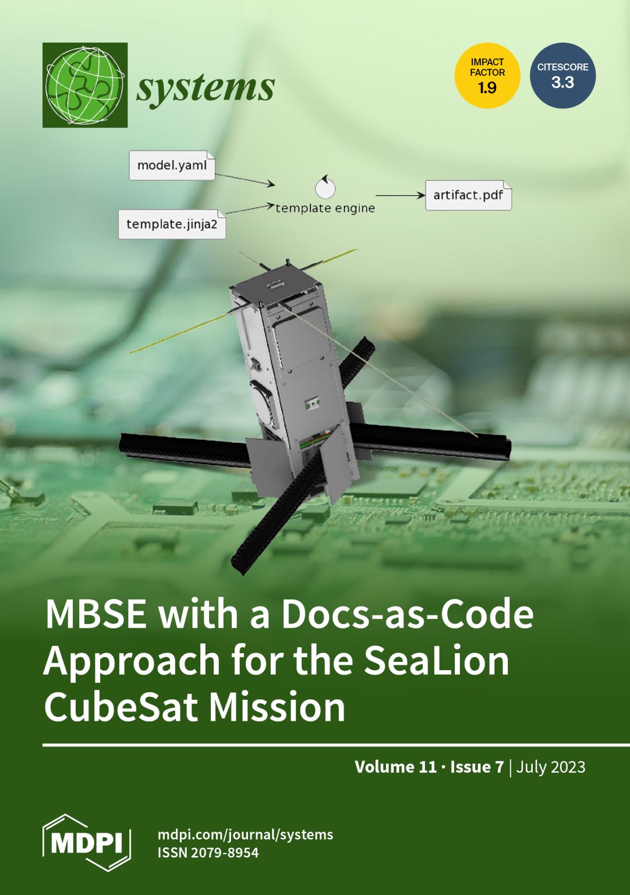
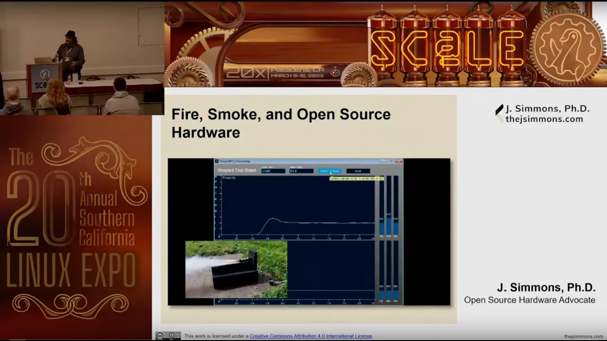
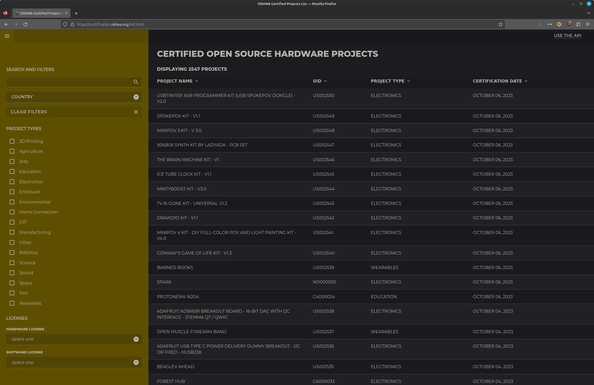
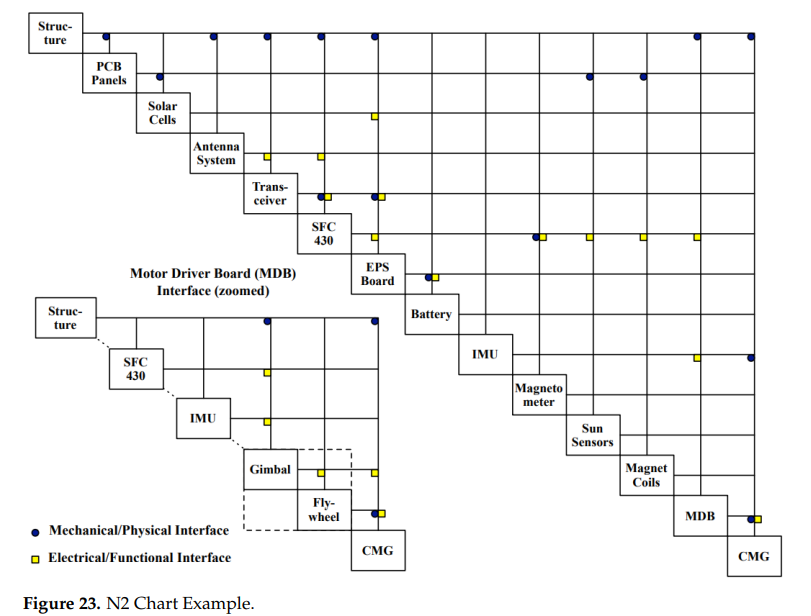

= Developing open-source (aerospace) hardware like OSS

by Sean Marquez

== Sealion Mission

image::images/cc-by.svg[CC-BY-4.0]
https://lnkd.in/gRDWqRxU

[.notes]
--
* This talk is a kind of summary of the ideas discussed in a paper I co-authored that was featured on the MDPI journal's systems category
* paper was in context to a CubeSat mission called Sealion - a joint project between the Old Dominion University and Coast Guard Academy, involving experimental payloads, s.a., a "deployable composite structure"
* the intent was to initially to adopt (what we coined as) a cross between a model-based and docs-as-code approach for capturing software systems requirements, and supporting traceability between requirements and implementation, but has since been extended to capturing the overall development of the hardware itself
--

[.columns]
=== CubeSats

[.column]
--
image::images/lightsail_bread_loaf.jpg[lightsail_bread_loaf, 501, 333]
"Planetary Society's Lightsail compared to bread" by Justin Jang
--

[.column]
--
image::images/lightsail.jpg[lightsail, 640, 360]
"Lightsail artist concept" by NASA Kennedy CC-BY-NC-ND-2.0
--

[.notes]
--
* Brief history on CubeSats, they're a class of smallscale satellites
* The specification was designed by CalPoly, literally the size of a loaf of bread
* The Planetary Society (located here in Pasadena) so far has launched 2 in the form of a Lightsail
* - an idea originally conceived by Louis Freedman (colleague of Carl Sagan)
* that light, although has no mass, has momentum that can be transferred to a reflective surface, thus providing a means of propulsion for lightweight spacecrafts
--

=== CubeSats by Mission Type (2000-2021)

image::images/swartwout_data_graph.jpg[swartwout_data, 624, 606]

[.notes]
--
* This chart briefly describes the popularity in CubeSats across academia, commercial space, and military
* Hence, CubeSats have become the kind of "app space" for space projects
* And because of their relatively small scale & low-cost, they're an ideal platform developing aerospace hardware in a kind of "agile development"/fail-fast culture 
--

== Mach 30 Foundation

image::images/mach_30_legacy_logo.png[mach_30_legacy_logo, 823, 232]

US non-profit specializing in Open Source Hardware for spaceflight.

[.notes]
--
* Much of the methodologies discussed in the paper are adopted from an organization calle Mach 30 - a US-based non-profit space hardeware development
--

=== Shepard Test Stand

https://www.socallinuxexpo.org/scale/20x/presentations/fire-smoke-and-open-source-hardware

[.notes]
--
* They presented this past March at SCaLE, which you can watch at this link
* in which they showcased a project called Shepard - a test stand designed for Estes model rockets, certified as https://certification.oshwa.org/us000006.html[OSHW US000006] under the auspice of the Open Source Hardware Association (OSHWA)
* Its one of the earliest certification no. on the planet
* So successful, the project has been "forked" twice, one featured at the Coca cola Science Center and a father & son referred to as the Jones Boys rocketry that went off and won several science fair projects, including one organized by AIAA - the professional association for aerospace engineers
* Hence, making for a candidate case study for OSHW development, particularly in aerospace
--

=== OSHWA Certified Projects

https://certification.oshwa.org/list.html

[.notes]
--
* For context, we're currently now at over 2500 certified OSHW projects on the OSHWA database
* You can search and look at the list of current certified project at this URL
--

=== Open Source Hardware Definition

image::images/oshwa_logo.jpg[oshwa_logo, 500, 144]

_“Open Source Hardware (OSHW) is a term for tangible artifacts
— machines, devices, or other physical things
— whose design has been released to the public in such a way that anyone can make, modify, distribute, and use those things.”_ - https://www.oshwa.org/definition/[The Definition of OSHW]

https://www.oshwa.org/definition

[.notes]
--
* One of the core tenants the Shepard team leaned into is the OSHW definition established by the OSHWA
* *tangible artifacts* (machines, devices, or other physical things) whose design has been released to the public in such a way that anyone can make, modify, distribute, and use those things.
* essentially the OSS definition, but where *tangible artifacts* are the *compiled binary* equivalent for an OSHW project
--

=== Distributed OSHW Framework (DOF) 

Approach to capturing the "source" of OSHW like OSS

[%step]
* *Bill of Materials* (BoM) data
* *Assembly Instructions* data
* Supporting Material (e.g., design files, schematics, operating instructions)

https://mach30.github.io/dof

[.notes]
--
* Through a series of agile retrospectives, the Shepard team discovered that as the project grew in complexity, the contents of the project became unmaintainable
* e.g., you make one part change and all hell breaks loose trying to find every section of every document where that part is referenced
* i.e., documents are not *DRY*; they don't conform to *don't repeat yourself*
* So the conclusion was a need for (not a tool, but rather) a methodology to persisting "souce" of an OSHW project
* This includes the *bill of materials* data (i.e., the list of parts and tools that need to be procured before you can build the project), the *assembly instructions* needed to put the project together, and any remaining *supporting material* (i.e., CAD files, schematics, operating instructions)
--

[.columns]
=== Why re-invent tools for OSHW that OSS tools already solve

[.column]
--
image::images/Git-Logo-1788C.svg[git_logo, 270]
image::images/Npm-logo.svg[npm_logo, 270]
--

[.column]
--
image::images/Yarn-logo-kitten.svg[yarn_logo, 270]
image::images/Gradle_logo.png[gradle_logo, 270]
image::images/jinjalogo.svg[jinja_logo, 270]
--

[.notes]
--
* Without getting too into the weeds of the core DOF data model,
* OSS tools already have a decade-plus start in terms of solving problems, like version control for branch, forking, and merging a project, or diffing part no. changes in a BOM, or things like dependency management for OSHW projects reused across other projects, albeit as a part or tool
* Imagine running `npm install arduino-uno` and import all the contents to be able to use an arduino-uno as a dependency in your project
--

=== m30ml

* modeling language for domain-specific languages (DSLs) on the local filesystem
* DOF is merely a DSL of m30ml
* OSHW standards https://github.com/oshwa/oshw-standards

[.notes]
--
* and because this is very MVP, DOF has since split into another base project called Mach 30 modeling language (or m30ml), to be able to model more generic concepts, s.a., actors, or user stories
* because one of the working groups we're support is a standards group with OSHWA to accommodate OSHW in medical or aerospace industry that may have some kind of regulatory standard
* which you can follow at this link
--

== DOF-CubeSat

Extension of DOF for CubeSats

https://github.com/ODU-CGA-CubeSat/dof-cubesat
https://github.com/ODU-CGA-CubeSat/cubesat-cli

[.notes]
--
* Sealion team is also developing extension of DOF, called DOF-CubeSat, to support concepts s.a., interfaces and junctions as to allow generating system model views such as this N2chart
* and to support a growing ecosystem of open-source cubesat developers, the DOF-CubeSat schema also serves as a spec for tooling implementors to use as a set of machine-readable requirements that you can just parse from whatever flavor programming language of choice
* but regardless of what tool you use, the underlying data model of how your projects persist on disk will remain consistent, so you can ensure your deployable lightsail project can be used for future cubesat mission, so that someone else comes along can `npm install lightsail` in their cubesat project and just focus on their mission-specific payload
--

== Questions?
